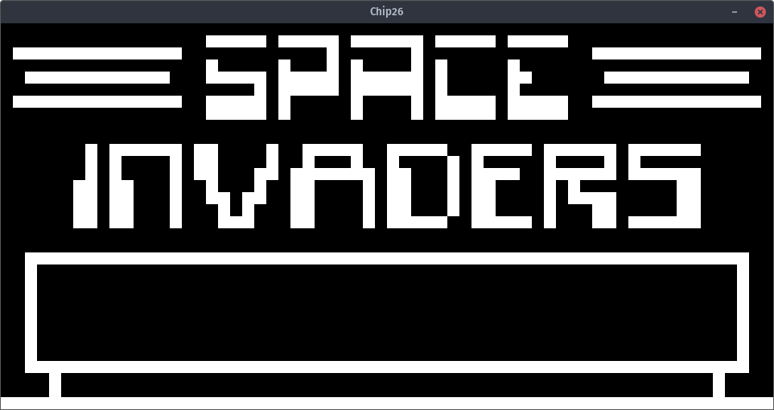

# Chip26  
An emulator for the old Chip-8 system, built in .NET

# How-To  
Download the roms you want to use.  
The program takes your preferred ROM as an cmd argument, but by default it runs Space Invaders.
Run the installer (Windows build) or extract the program to a folder (linux build) and launch Chip26(.exe) with the path of your ROM as the first argument.  
CHIP-8 uses keys 0-9 and A-F for input. In the future, these will be able to be remapped through the config, although the backend required for that already exists.

